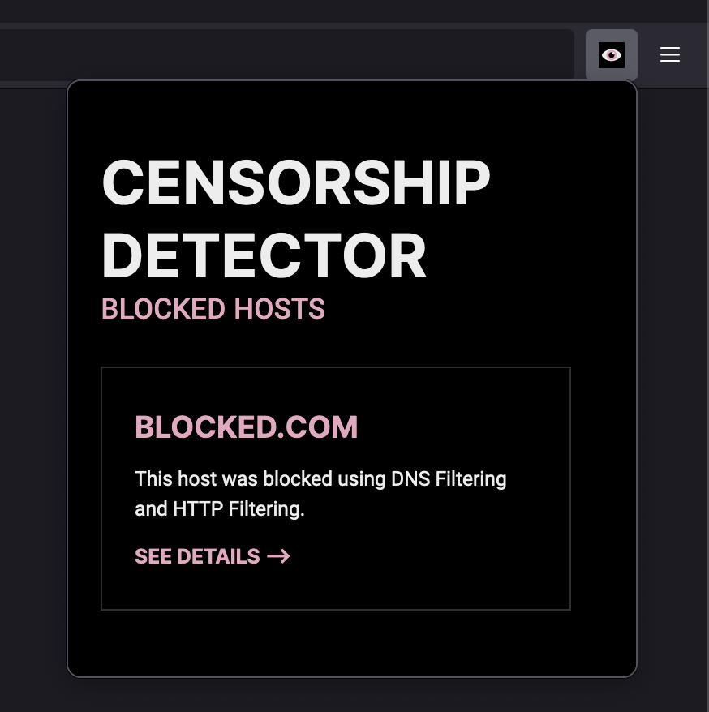

# Censorship Detector Extension

A browser extension to detect website censorship and the censorship methods used.



## Demo

https://user-images.githubusercontent.com/14217083/159095602-641cabb2-de13-407d-b422-cc42d4af1345.mp4

## The story

In 2021, the Lebanese government blocked local exchange rate websites. Some reports said that the local internet service providers were using DNS filtering (i.e blocking the websites by tampering the DNS answer). However, upon testing my own network, I found something peculiar: even when I changed my local DNS resolver, the websites were still blocked. Ofcourse, one can imagine how that would happen over HTTP—a censor would filter based on the host header. Yet, the websites were also blocked over HTTPS! Upon further inspection, it turned out to be SNI (Server Name Indication) filtering; in other words, my ISP was filtering by the SNI extension in the TLS handshake.

I wondered what other censorship methods Lebanese ISPs were using. I got in touch with friends on other networks, but there was a problem: running traditional censorship detection tools was either too technical or yielded inaccurate results. Hence this extension! 

The extension can currently detect DNS, HTTP, HTTPS, and IP filtering. It is built with a modular architecture, allowing for other checks to be added in the future. Do note that it is highly experimental and relies on testing the limits of some browser extension APIs, so use it critically.

## But why a browser extension?

There are multiple benefits to detecting censorship methods from a browser extension:

- Browser extensions are easy to install
- We can continuously detect censorship, since we see all browser traffic
- We don't rely on a fixed set of URLs, allowing for ubiquitous censorship detection
- Most importantly though, it is technically cool

## Installation

Apologies for having to build the extension and create a release! The extension is still in an experimental phase.

1. Build the browser extension:

  ```shell
  $ npm run build
  ```

2. Create a release:

  ```sh
  $ npm run release
  ```

  The releases will be located at `/releases/${BROWSER}/`. You can distribute those freely.

3. To load into Firefox, browser to `about:debugging#/runtime/this-firefox` and load the release zip file via `Load Temporary Add-on...`. To load into a Chromium browser, unzip the file, browse to `chrome://extensions`, and `Load unpacked` the unzipped directory.
